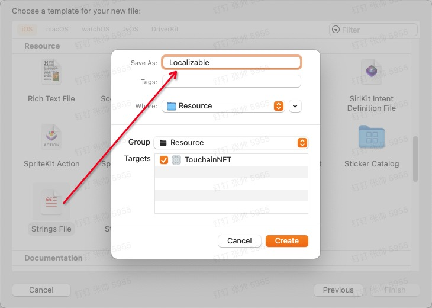

# iOS国际化总结
推荐文章 [iOS语言国际化/本地化-实践总结](https://www.jianshu.com/p/ed249bd3473b)
[App的国际化和本地化（一） —— 简单介绍（一）](https://www.jianshu.com/p/15a8a968b5c4)
[App的国际化和本地化（二） —— 查看语言和区域设置（一）](https://www.jianshu.com/p/bcb2ae2aa1c3)
[App的国际化和本地化（三） —— 国际化用户界面（一）](https://www.jianshu.com/p/427778f9cfb3)
[App的国际化和本地化（四） —— 国际化代码（一）](https://www.jianshu.com/p/3e087fcbeab2)
[App的国际化和本地化（五） —— 使用区域设置格式化数据（一）简书正在审核]()
[App的国际化和本地化（六） —— 支持从右到左的语言（一）](https://www.jianshu.com/p/89deaa97ed9a)
[App的国际化和本地化（七） —— 本地化你的App（一）](https://www.jianshu.com/p/98e66c3c8572)
[App的国际化和本地化（八） —— 测试您的国际化应用程序（一）](https://www.jianshu.com/p/5f881fe5af45)
[App的国际化和本地化（九） —— 自己管理字符串文件（一）](https://www.jianshu.com/p/61b07f6da673)
[App的国际化和本地化（十） —— 语言和区域ID（一）](https://www.jianshu.com/p/9c049cf32f4b)
[App的国际化和本地化（十一） —— Stringsdict文件格式（一）](https://www.jianshu.com/p/a271347324de)

## iOS国际化原理分析 TODO

## 配置语言

首先点击`项目->PROJECT->Info->Localizations`中添加要支持的语言.


>此处Use Base Internationalization开启状态下，每个国际化资源文件会有个Base选项，主要针对String，Storyboard，Xib作为一个基础的模板，像后述storyboard国际化中方案二就是基于Base StoryBoard进行改动。

在点击`+`添加相应语言时会弹出以下对话框，意思是为现有的资源添加语言文件，选择要支持的语言然后点击`Finish`就行了

## 文字国际化

### 创建默认 Localizabel.strings
新建文件 `New File -> Strings File ，取名为Localizabel` 如下图所示


我们通过一个`Localizable.strings`文件来存储每个语言的文本，它是iOS默认加载的文件，如果想用自定义名称命名，在使用`NSLocalizedString`方法时指定`tableName`为自定义名称就好了，但你的应用规模不是很大就不要分模块搞特殊了。

每个资源文件如果想为一种语言添加支持，通过其属性面板中的`Localization`添加相应语言就行了，此时`Localizable.strings`处于可展开状态，子级有着相应语言的副本。我们把相应语言的文本放在副本里面就行了


>此处Base与前面提过到的开启`Use Base Internationalization`是有关联的，只有开启了全局`Use Base Internationalization`此处才会显示。那为什么这里没有勾选Base？Base做为一个基础模板，作用于Strings文件是没有太大意义的，另外去掉Base意义着在Base.lproj中少了一个strings文件，APP大小也所有下降，这点对于图片的Base更是如此 **Xcode13.1中已经无此选项, 已经废弃？**

**文件举例**


**代码使用**
```
NSLocalizedString("首页",comment: "")
NSLocalizedString("好友",comment: "")
NSLocalizedString("我",comment: "")
```
另外中文`strings【Localizable.strings(Simplified)】`可以不要的(可以理解为中文为APP的默认语言)，因为key就是value，当找不到相应的语言strings或value时会直接返回key。nice！这样一来我们做文本的国际化就只要维护一个英文副本strings就O了

## 图片的国际化

### 方案一 利用Localizable.strings自定义文本

代码：`UIImage(named: NSLocalizedString("search_logo",comment: ""))`

### 方案二 Assets 支持国际化
选中`Image Set` 点击 `Localize...` 选择支持的语言，如下图


## Storyboard国际化 (未亲自测试)

前面的两种资源国际化比较简单，但Storyboard国际化就稍微麻烦了点。同样它也有二种方案

方案一：每种语言定制一套Storyboard

在上图我们可以看到，每种语言都可以切换为strings或Storyboard（默认为strings）。如果选用Interface Builder Storyboard方案，那么每种语言都有一套相应的Storyboard，各个语言Storyboard间的界面改动不关联.

在上图我们可以看到，每种语言都可以切换为strings或Storyboard（默认为strings）。如果选用Interface Builder Storyboard方案，那么每种语言都有一套相应的Storyboard，各个语言Storyboard间的界面改动不关联.

基于一个基础的Storyboard，可以看作是一个基础的模板，Storyboard里面所有的文本类资源(如UILabel的text)都会被放在相应语言的strings里面。此时我们为Storyboard里的字符类资源作国际化只需要编辑相应语言的strings就行了

首选方案二。因为采用方案一，意义着你每改动一个界面元素就得去相应语言Storyboard一一改动，那跟为每个语言新起一个项目是一样的道理。但是采用方案二，我们只需改动Base Storyboard就行了.

注意，方案二中相应语言的strings一旦生成后，Base Storyboard有任何编辑都不会影响到strings，这就意味着如果我们删除或添加了一个UILabel的text，strings也不能同步改动。

还好，Xcode为我们提供了ibtool工具来生成Storyboard的strings文件。
`ibtool Main.storyboard --generate-strings-file ./NewTemp.string`
但是ibtool生成的strings文件是BaseStoryboard的strings(默认语言的strings)，且会把我们原来的strings替换掉。所以我们要做的就是把新生成的strings与旧的strings进行冲突处理(新的附加上，删除掉的注释掉)，这一切可以用这个pythoy脚本来实现，见[AutoGenStrings.py](https://raw.githubusercontent.com/mokai/iOS-i18n/master/i18n/RunScript/AutoGenStrings.py)。然后我们将借助Xcode 中 Run Script来运行这段脚本。这样每次Build时都会保证语言strings与Base Storyboard保持一致。


## xib国际化配置

### 方案一 - 每种语言定制一套xib 

xib 国际化：
        此示例都选择Interface Builder CocoaTouch Xib 选项
        中文下显示中文xib的内容
        英文下显示英文xib的内容
        这样的话是维护两套xib的内容


如图：

 


代码：
```swift
override func viewDidLoad() {
        super.viewDidLoad()

        // Do any additional setup after loading the view.
        
        // xib 国际化：
        // 此示例都选择Interface Builder CocoaTouch Xib 选项
        // 中文下显示中文xib的内容
        // 英文下显示英文xib的内容
        // 这样的话是维护两套xib的内容
        
        // 还可以用代码进行分类配置
        //获取APP的语言数组
        //let appLanguages = UserDefaults.standard.object(forKey: "AppleLanguages")
        if let appLanguages = UserDefaults.standard.object(forKey: "AppleLanguages") as? [String], let languageName = appLanguages.first {
            
            if languageName == "zh-Hans-US" {
                chTestLabel.text = "全世界都在说中国话"
            } else if languageName == "en" {
                enTestLabel.text = "what??"
                enTestLabel2.text = "english is hard"
            }
        }
        
        //ex
        //获取当前设备支持的所有语言
        // 获取当前设备支持语言数组
        let arr = NSLocale.availableLocaleIdentifiers
        print(arr) //很多
    }
```

### 方案二 

 


方案二xib国际化示例

        /// localization 选择 Base  
        English:Localizable Strings 
        Chinese: Localizable Strings
        /// xib只添加label，在strings文件中会生成相对于的配置文字代码
        /// 如：
        /// ```
        /// /* Class = "UILabel"; text = "Label"; ObjectID = "Ima-pm-Edd"; */
        /// "Ima-pm-Edd.text" = "我为你做了一切";
        /// ```
        /// 在其他语言文件中同样进行配置，就可实现国际化
        /// ```
        /// /* Class = "UILabel"; text = "Label"; ObjectID = "Ima-pm-Edd"; */
        /// "Ima-pm-Edd.text" = "i do everything for everything for you";
        /// ```
        /// 在对应的viewcontroller文件中，可对label进行设置
        /// `testLabel.text = NSLocalizedString("Year", comment: "")`
        ///

strings-en     
```
/* Class = "UILabel"; text = "Label"; ObjectID = "Ima-pm-Edd"; */
"Ima-pm-Edd.text" = "i do everything for everything for you";
"OId-wY-9E7.text" = "i like oo";
```

strings-ch
```
/* Class = "UILabel"; text = "Label"; ObjectID = "Ima-pm-Edd"; */
"Ima-pm-Edd.text" = "我为你做了一切";
"OId-wY-9E7.text" = "我喜欢";
```


[详细代码见i18n-Demo](i18n-Demo/)

## 应用内实现语言实时切换国际化

应用启动时，首先会读取`NSUserDefaults`中的`key`为`AppleLanguages`的内容，该key返回一个String数组，存储着APP支持的语言列表，数组的第一项为APP当前默认的语言。

在安装后第一次打开APP时，会自动初始化该key为当前系统的语言编码，如简体中文就是`"zh-Hans"`。

```
//获取APP当前语言
guard let language = (UserDefaults.standard.object(forKey: kUserLanguage) as? [String])?.first else {
    assert(false, "未知错误，获取APP语言失败")
    return
}
```
那么我们要实现语言切换改变`AppleLanguages`的值即可，但是这里有一个坑，因为苹果没提供给我们直接修改APP默认语言的API，我们只能通过`NSUserDefaults`手动去操作，且`AppleLanguages`的值改变后APP得重新启动后才会生效（才会读取相应语言的lproj中的资源，意义着就算你改了，资源还是加载的APP启动时lproj中的资源），猜测应该是框架层在第一次加载时对`AppleLanguages`的值进行了内存缓冲.

```
//设置APP当前语言
UserDefaults.standard.setValue(["zh-Hans"], forKey: kUserLanguage)
```

那么问题来了，如何做到改变AppleLanguages的值就加载相应语言的lproj资源？

其实，APP中的资源加载（Storyboard、图片、字符串）都是在`NSBundle.mainBundle()`上操作的，那么我们只要在语言切换后把`NSBundle.mainBundle()`替换成当前语言的bundle就行了，这样系统通过`NSBundle.mainBundle()`去加载资源时实则是加载的当前语言bundle中的资源

```
//
//  NSBundle+Language.swift
//  i18n-Demo
//
//  Created by safiri on 2021/11/6.
//

import Foundation

/**
 *  当调用onLanguage后替换掉mainBundle为当前语言的bundle
 */
class BundleEx: Bundle {
    
    override func localizedString(forKey key: String, value: String?, table tableName: String?) -> String {
        if let bundle = languageBundle() {
            return bundle.localizedString(forKey: key, value: value, table: tableName)
        } else {
            return super.localizedString(forKey: key, value: value, table: tableName)
        }
    }
}

extension Bundle {
    
    //代替dispatch_once
    private static var onLanguageDispatchOnce: ()->Void = {
        object_setClass(Bundle.main, BundleEx.self)
    }
    
    func onLanguage() {
        //替换NSBundle.mainBundle()的class为自定义的BundleEx，这样一来我们就可以重写方法
        Bundle.onLanguageDispatchOnce()
    }
    
    //当前语言的bundle
    func languageBundle() -> Bundle? {
        return Languager.sharedInstance.currentLanguageBundle
    }
}

```
[详细代码见i18n-Demo](i18n-Demo/)

## LaunchScreen.xib的国际化
xcode13已支持

[参考-详述iOS国际化](http://www.cocoachina.com/articles/14258)
## 增加

#### 关于 NSLocalizedString 方法的解释
```swift

/// Returns the localized version of a string.
///
/// - parameter key: An identifying value used to reference a localized string.
///   Don't use the empty string as a key. Values keyed by the empty string will
///   not be localized.
/// - parameter tableName: The name of the table containing the localized string
///   identified by `key`. This is the prefix of the strings file—a file with
///   the `.strings` extension—containing the localized values. If `tableName`
///   is `nil` or the empty string, the `Localizable` table is used.
/// - parameter bundle: The bundle containing the table's strings file. The main
///   bundle is used by default.
/// - parameter value: A user-visible string to return when the localized string
///   for `key` cannot be found in the table. If `value` is the empty string,
///   `key` would be returned instead.
/// - parameter comment: A note to the translator describing the context where
///   the localized string is presented to the user.
///
/// - returns: A localized version of the string designated by `key` in the
///   table identified by `tableName`. If the localized string for `key` cannot
///   be found within the table, `value` is returned. However, `key` is returned
///   instead when `value` is the empty string.
///
/// Export Localizations with Xcode
/// -------------------------------
///
/// Xcode can read through a project's code to find invocations of
/// `NSLocalizedString(_:tableName:bundle:value:comment:)` and automatically
/// generate the appropriate strings files for the project's base localization.
///
/// In Xcode, open the project file and, in the `Edit` menu, select
/// `Export for Localization`. This will generate an XLIFF bundle containing
/// strings files derived from your code along with other localizable assets.
/// `xcodebuild` can also be used to generate the localization bundle from the
/// command line with the `exportLocalizations` option.
///
///     xcodebuild -exportLocalizations -project <projectname>.xcodeproj \
///                                     -localizationPath <path>
///
/// These bundles can be sent to translators for localization, and then
/// reimported into your Xcode project. In Xcode, open the project file. In the
/// `Edit` menu, select `Import Localizations...`, and select the XLIFF
/// folder to import. You can also use `xcodebuild` to import localizations with
/// the `importLocalizations` option.
///
///     xcodebuild -importLocalizations -project <projectname>.xcodeproj \
///                                     -localizationPath <path>
///
/// Choose Meaningful Keys
/// ----------------------
///
/// Words can often have multiple different meanings depending on the context
/// in which they're used. For example, the word "Book" can be used as a noun—a
/// printed literary work—and it can be used as a verb—the action of making a
/// reservation. Words with different meanings which share the same spelling are
/// heteronyms.
///
/// Different languages often have different heteronyms. "Book" in English is
/// one such heteronym, but that's not so in French, where the noun translates
/// to "Livre", and the verb translates to "Réserver". For this reason, it's
/// important make sure that each use of the same phrase is translated
/// appropriately for its context by assigning unique keys to each phrase and
/// adding a description comment describing how that phrase is used.
///
///     NSLocalizedString("book-tag-title", value: "Book", comment: """
///     noun: A label attached to literary items in the library.
///     """)
///
///     NSLocalizedString("book-button-title", value: "Book", comment: """
///     verb: Title of the button that makes a reservation.
///     """)
///
/// Use Only String Literals
/// ------------------------
///
/// String literal values must be used with `key`, `tableName`, `value`, and
/// `comment`.
///
/// Xcode does not evaluate interpolated strings and string variables when
/// generating strings files from code. Attempting to localize a string using
/// those language features will cause Xcode to export something that resembles
/// the original code expression instead of its expected value at runtime.
/// Translators would then translate that exported value—leaving
/// international users with a localized string containing code.
///
///     // Translators will see "1 + 1 = (1 + 1)".
///     // International users will see a localization "1 + 1 = (1 + 1)".
///     let localizedString = NSLocalizedString("string-interpolation",
///                                             value: "1 + 1 = \(1 + 1)"
///                                             comment: "A math equation.")
///
/// To dynamically insert values within localized strings, set `value` to a
/// format string, and use `String.localizedStringWithFormat(_:_:)` to insert
/// those values.
///
///     // Translators will see "1 + 1 = %d" (they know what "%d" means).
///     // International users will see a localization of "1 + 1 = 2".
///     let format = NSLocalizedString("string-literal",
///                                    value: "1 + 1 = %d",
///                                    comment: "A math equation.")
///     let localizedString = String.localizedStringWithFormat(format, (1 + 1))
///
/// Multiline string literals are technically supported, but will result in
/// unexpected behavior during internationalization. A newline will be inserted
/// before and after the body of text within the string, and translators will
/// likely preserve those in their internationalizations.
///
/// To preserve some of the aesthetics of having newlines in the string mirrored
/// in their code representation, string literal concatenation with the `+`
/// operator can be used.
///
///     NSLocalizedString("multiline-string-literal",
///                       value: """
///     This multiline string literal won't work as expected.
///     An extra newline is added to the beginning and end of the string.
///     """,
///                       comment: "The description of a sample of code.")
///
///     NSLocalizedString("string-literal-contatenation",
///                       value: "This string literal concatenated with"
///                            + "this other string literal works just fine.",
///                       comment: "The description of a sample of code.")
///
/// Since comments aren't localized, multiline string literals can be safely
/// used with `comment`.
///
/// Work with Manually Managed Strings
/// ----------------------------------
///
/// If having Xcode generate strings files from code isn't desired behavior,
/// call `Bundle.localizedString(forKey:value:table:)` instead.
///
///     let greeting = Bundle.localizedString(forKey: "program-greeting",
///                                           value: "Hello, World!",
///                                           table: "Localization")
///
/// However, this requires the manual creation and management of that table's
/// strings file.
///
///     /* Localization.strings */
///
///     /* A friendly greeting to the user when the program starts. */
///     "program-greeting" = "Hello, World!";
///
/// - note: Although `NSLocalizedString(_:tableName:bundle:value:comment:)`
/// and `Bundle.localizedString(forKey:value:table:)` can be used in a project
/// at the same time, data from manually managed strings files will be
/// overwritten by Xcode when their table is also used to look up localized
/// strings with `NSLocalizedString(_:tableName:bundle:value:comment:)`.
public func NSLocalizedString(_ key: String, tableName: String? = nil, bundle: Bundle = Bundle.main, value: String = "", comment: String) -> String

```
